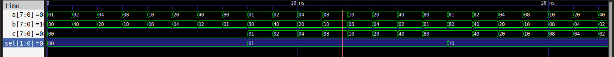

#Multiplexer

In this example, we are going to build a 8 bit 2 to 1  multiplexer with the help of the ieee1164 library types.

With this example we are able to learn more about the std_logic type.

The testbench tests the circuit in this steps:
- select "00"
- change A and B values and check if C remains on "00000000"
- select "01"
- change A and B values and check if C is outputing A values
- select "10"
- change A and B values and check if C is outputing B values
- select "11"
- change A and B values and check if C is in high impedance output ("Z")

Improvements for the next testbenches:

I could use more then one process to the test, for example: one process to change de selection of the mux, another to input values on A and B and read the output on C.
With this, the test could more flexible.
